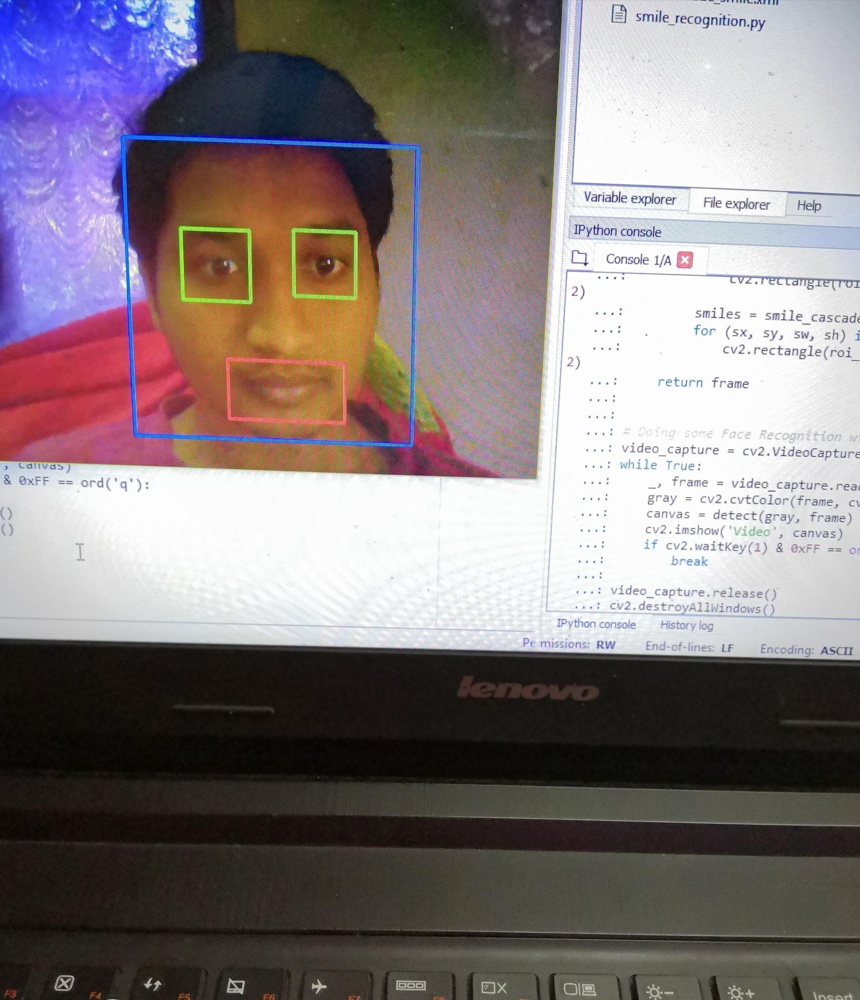

# Face Detection 

Face Recognizer using openCV haarcascades

A Haar Cascade is basically a classifier which is used to detect particular objects from the source. These haar cascade designed by OpenCV to detect the frontal faces. These are available on github.

# Sample Ouput Image

